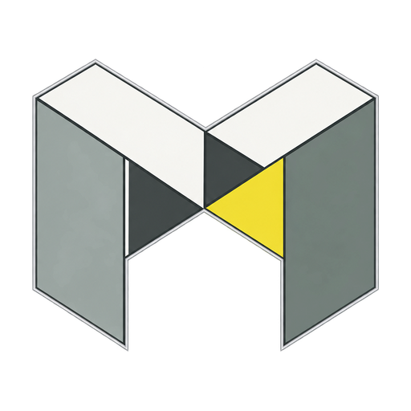

<p align="center">
  
</p>

# Meshropractor

**Подготовка CAD и сеток для аддитивного производства и компенсация геометрии по данным 3D-сканирования.**

[](https://github.com/B0ogie888/Meshropractor/actions/workflows/tests.yml)
[](CHANGELOG.md)
[](#установка)
[](#приложение-для-linux)
[](requirements.txt)

[English](README.md) · [Релизы](https://github.com/B0ogie888/Meshropractor/releases) · [Руководство](docs/USER_GUIDE_RU.md) · [История изменений](CHANGELOG.md)

Meshropractor объединяет подготовку деталей и компенсацию геометрических отклонений
в одном настольном приложении. Загружайте STL или STEP, исправляйте и размещайте
детали, выбирайте CAD-поверхности для поддержек, сравнивайте номинальную модель
со сканом и экспортируйте компенсированную геометрию.

Два рабочих пространства используют общие инструменты и формат проекта:

- **Слайсер:** подготовка моделей, платформы построения, поддержки, сечения и измерения.
- **Предеформация:** совмещение CAD со сканом, анализ отклонений и обучение поля смещений.

## Содержание

- [Возможности](#возможности)
- [Установка](#установка)
- [Быстрый старт](#быстрый-старт)
- [Управление](#управление)
- [Форматы](#форматы)
- [Документация](#документация)
- [Разработка](#разработка)
- [Возможности и ограничения расчётов](#возможности-и-ограничения-расчётов)
- [Обратная связь и поддержка](#обратная-связь-и-поддержка)

## Возможности

| Направление | Что можно сделать |
| --- | --- |
| **CAD / BREP** | Сохранить тела и поверхности STEP, изменить качество триангуляции, выбрать целую CAD-грань и экспортировать преобразованную модель в STEP. |
| **Исправление сеток** | Найти разрывы, ошибки нормалей, фрагменты, нахлёсты и пересечения; подготовить автоматическое или ручное исправление с предпросмотром и Undo/Redo. |
| **Расположение** | Перемещать, вращать, масштабировать, отражать и копировать детали; раскладывать их на платформе и в объёме камеры, сравнивать ориентации. |
| **Поддержки** | Создавать поддержки автоматически или задавать области вручную. Группы принадлежат исходной детали и следуют её преобразованиям. |
| **Просмотр и измерения** | Совмещать плоскости сечения, измерять геометрию и видеть текущие объём, стоимость материала и плотность размещения выбранных деталей. |
| **Компенсация** | Совместить CAD и скан, построить карту отклонений, обучить поле смещений и экспортировать компенсированный STL с отдельными коэффициентами XY/Z. |
| **Проекты** | Сохранить модели, BREP, поддержки, платформы и результаты в `.mrp`; отменять и повторять изменения в текущем сеансе. |

## Установка

### Приложение для Windows

Опубликованные установщики Windows x64 доступны в [Releases](https://github.com/B0ogie888/Meshropractor/releases).
Для готовой сборки Python отдельно не нужен. Переносимая сборка использует всю папку
`dist\Meshropractor`, включая `_internal`.

Текущая версия исходников — **0.2.6**, она задаётся в [VERSION](VERSION).
Опубликованные установщики могут отставать от исходников. Для локальной сборки этой
версии используйте [инструкцию PyInstaller и Inno Setup](docs/BUILD_WINDOWS.md).

В Windows при запуске приложение проверяет стабильные релизы на обновления. Скачивание
показывает прогресс и допускает отмену; установка требует отдельного подтверждения.

### Приложение для Linux

Версия **0.2.6** также собирается в `meshropractor_0.2.6_amd64.deb` для
**Debian 12 и Ubuntu 24.04, x86-64**. Python и зависимости приложения включены
в пакет; используется CPU-версия PyTorch. Для графики нужны OpenGL и X11
либо XWayland в сеансе Wayland.

Установите собранный пакет из его каталога:

```bash
sudo apt install ./meshropractor_0.2.6_amd64.deb
meshropractor
```

Приложение также появится в меню программ. Обновления Linux устанавливаются через
APT; кнопка проверки обновлений открывает страницу релизов. Сборка через Docker,
зависимости и проверка в чистой системе описаны в [инструкции Linux](docs/BUILD_LINUX.md).
Опубликованные файлы релизов могут отставать от доступных сборок исходников.

### Запуск из исходников

Исходники проверены в **Windows x64 и Debian 12 с Python 3.12**. NVIDIA GPU с CUDA необязателен:
обучение работает и на CPU. Зависимости закреплены в [requirements.txt](requirements.txt).

В PowerShell:

```powershell
git clone https://github.com/B0ogie888/Meshropractor.git
cd Meshropractor
py -3.12 -m venv .venv
```

Установите **одну** сборку PyTorch:

```powershell
# CPU
.\.venv\Scripts\python.exe -m pip install torch==2.5.1 --index-url https://download.pytorch.org/whl/cpu
```

Или для NVIDIA CUDA 12.1:

```powershell
.\.venv\Scripts\python.exe -m pip install torch==2.5.1 --index-url https://download.pytorch.org/whl/cu121
```

Установите остальные зависимости и запустите приложение:

```powershell
.\.venv\Scripts\python.exe -m pip install -r requirements.txt
.\.venv\Scripts\python.exe src/Meshropractor.py
```

На Linux с Python 3.12 и установленными системными библиотеками Qt/OpenGL:

```bash
python3.12 -m venv .venv
.venv/bin/python -m pip install torch==2.5.1 --index-url https://download.pytorch.org/whl/cpu
.venv/bin/python -m pip install -r requirements.txt
.venv/bin/python src/Meshropractor.py
```

## Быстрый старт

### Подготовка детали

1. Откройте **«Слайсер»** и создайте платформу с нужными габаритами.
2. Импортируйте модель или перетащите STL/STEP в активную сцену. Для STEP выберите BREP или сетку и допуски триангуляции.
3. Выберите детали в сцене. Используйте **«Исправление»** для диагностики и **«Расположение»** для преобразований и раскладки.
4. Выделите поверхности и сгенерируйте поддержки либо настройте области через **«Поддержки вручную»**.
5. Проверьте сечения и измерения, сохраните проект `.mrp` и экспортируйте выбранную геометрию.

### Компенсация отклонений

1. Откройте **«Предеформация»**, загрузите номинальную CAD-модель (STL/STEP) и скан (STL).
2. Совместите модели автоматически или задайте минимум три пары неколлинеарных маркеров.
3. Постройте карту отклонений, проверьте качество совмещения и покрытие.
4. Задайте параметры обучения и коэффициенты компенсации, рассчитайте результат и экспортируйте STL.

Параметры инструментов, проверка лечения и смысл метрик описаны в [руководстве пользователя](docs/USER_GUIDE_RU.md).

## Управление

Жесты выделения в таблице относятся к режиму **выбора деталей** слайсера:

| Действие | Результат |
| --- | --- |
| Клик левой кнопкой по детали / пустому месту | Выбрать деталь / снять выбор всех деталей. |
| Рамка от пустого места | Выбрать несколько деталей. |
| Shift / Ctrl + клик или рамка | Добавить детали / переключить их выбор. |
| Двойной клик по детали / пустому месту | Вращать сцену вокруг детали / вернуть центр в центр плиты. |
| Alt + перетаскивание левой кнопкой | Вращать камеру, в том числе от пустого места. |
| Перетаскивание ПКМ, начатое внутри пунктирного круга | Вращать сцену в 3D, также при выборе поверхностей и измерении. |
| Перетаскивание ПКМ, начатое снаружи круга | Поворачивать вид по/против часовой стрелки в плоскости экрана. |
| Клик по грани куба | Направить камеру по выбранной грани. |
| Ctrl+S | Сохранить проект. |
| Ctrl+Z / Ctrl+Y или Ctrl+Shift+Z | Отменить / повторить изменение. |

При выделении поверхностей **Ctrl вычитает грани**. Полный список доступен в
**«Настройки и помощь → Горячие клавиши и управление»** и [руководстве](docs/USER_GUIDE_RU.md).

## Форматы

| Формат | Импорт | Экспорт и хранение |
| --- | --- | --- |
| **STL** | Детали слайсера, номинальный CAD и сканы. Координаты интерпретируются как миллиметры. | Детали с поддержками, результаты деформации и компенсации. |
| **STEP / STP** | CAD-тела и поверхности BREP либо треугольная сетка; единицы файла переводятся в миллиметры. | Выбранные CAD-тела с преобразованиями, пока BREP остаётся актуальным. |
| **MRP 2.1** | Сохранённые проекты, включая старые архивы 1.x и 2.0. | Геометрия, BREP, поддержки, платформы, результаты и настройки. |
| **VTP / PNG** | — | Контуры сечений / изображения сцены. |

Редактирование треугольников может сделать BREP неактуальным. Поддержки и результаты
компенсации остаются сетками; STEP-экспорт сохраняет номинальный CAD.

## Документация

| Руководство | Содержание |
| --- | --- |
| [Работа с приложением](docs/USER_GUIDE_RU.md) | Рабочие процессы, поддержки, измерения, преобразования и история проекта. |
| [CAD / STEP](docs/CAD.md) | Тела, поверхности, BREP, триангуляция и STEP-экспорт. |
| [Исправление сеток](docs/MESH_REPAIR.md) | Диагностика, команды лечения, допуски и проверка результата. |
| [Расположение](docs/PLACEMENT.md) | Раскладка, поиск ориентаций и критерии упаковки. |
| [Отображение](docs/DISPLAY.md) | Сечения, подписи сцены и статистика. |
| [Проверки](docs/VALIDATION.md) | Тесты, проверки нативной сцены и интерпретация точности. |
| [Производительность](docs/PERFORMANCE.md) | Изменения рендеринга и методика замеров. |
| [Сборка Windows](docs/BUILD_WINDOWS.md) | PyInstaller, Inno Setup и подготовка релизов. |
| [Сборка Linux](docs/BUILD_LINUX.md) | Пакет `.deb` для Debian/Ubuntu, Docker и проверка установки. |
| [English user guide](docs/USER_GUIDE.md) | Английская версия руководства пользователя. |

## Разработка

После настройки окружения запустите регрессионные тесты:

```powershell
.\.venv\Scripts\python.exe -m unittest discover -s tests -v
```

Нативные проверки открывают окно приложения и сохраняют отчёты и снимки в `output/`:

```powershell
.\.venv\Scripts\python.exe scripts/smoke_cad_display.py
.\.venv\Scripts\python.exe scripts/smoke_selection_statistics.py
```

Версия 0.2.6 прошла **345 локальных регрессионных тестов**, а также проверки готового
EXE, упакованных STEP-библиотек и модуля лечения. GitHub Actions запускает тесты на Windows;
текущий статус показан значком в начале страницы. Область проверок описана в [документации](docs/VALIDATION.md).

| Каталог | Назначение |
| --- | --- |
| `src/` | Интерфейс Qt/VTK, CAD и сетки, фоновые задачи и компенсация. |
| `tests/` | Регрессионные тесты геометрии, контроллеров и интерфейса. |
| `scripts/` | Проверки нативных сцен и профилирование. |
| `packaging/linux/` | Среда сборки Linux, пакет Debian и проверка установки. |
| `docs/` | Документация пользователя и разработчика. |
| `assets/` | Значки и ресурсы приложения. |
| `licenses/repair-engine/` | Исходники и лицензии отдельного модуля лечения. |

Для упаковки установите [requirements-dev.txt](requirements-dev.txt):

```powershell
.\.venv\Scripts\python.exe -m pip install -r requirements-dev.txt
```

Сначала собирается модуль лечения, затем приложение; команды приведены
в инструкциях сборки [Windows](docs/BUILD_WINDOWS.md) и [Linux](docs/BUILD_LINUX.md).

## Возможности и ограничения расчётов

- BREP сохраняется для CAD-операций; совмещение, поддержки, измерения и карты отклонений используют триангуляцию.
- Раскладка использует ограничивающие параллелепипеды. Поддержки и компенсацию нужно проверять для выбранного процесса печати.
- Компенсация аппроксимирует измеренные смещения, без симуляции физики печати. Метрики не подтверждают производственные допуски.
- Экспорт машинных заданий CLS из интерфейса отключён до проверки на оборудовании. Полной эквивалентности Materialise Magics нет.

Ограничения отдельных алгоритмов описаны в руководствах. Лицензии и исходники
независимого модуля лечения находятся в [licenses/repair-engine](licenses/repair-engine/README.md).

## Обратная связь и поддержка

Об ошибках и предложениях пишите в [GitHub Issues](https://github.com/B0ogie888/Meshropractor/issues).
Для ошибки укажите версию приложения, шаги воспроизведения, ожидаемый результат
и относящийся к проблеме фрагмент журнала.

Журнал оконной сборки: `%LOCALAPPDATA%\Meshropractor\logs\Meshropractor.log`.
В pull request опишите решаемую проблему и выполненные проверки.

[Поддержать автора на Boosty](https://boosty.to/boogie888) · [Связаться по почте](mailto:theboogie888@gmail.com)
